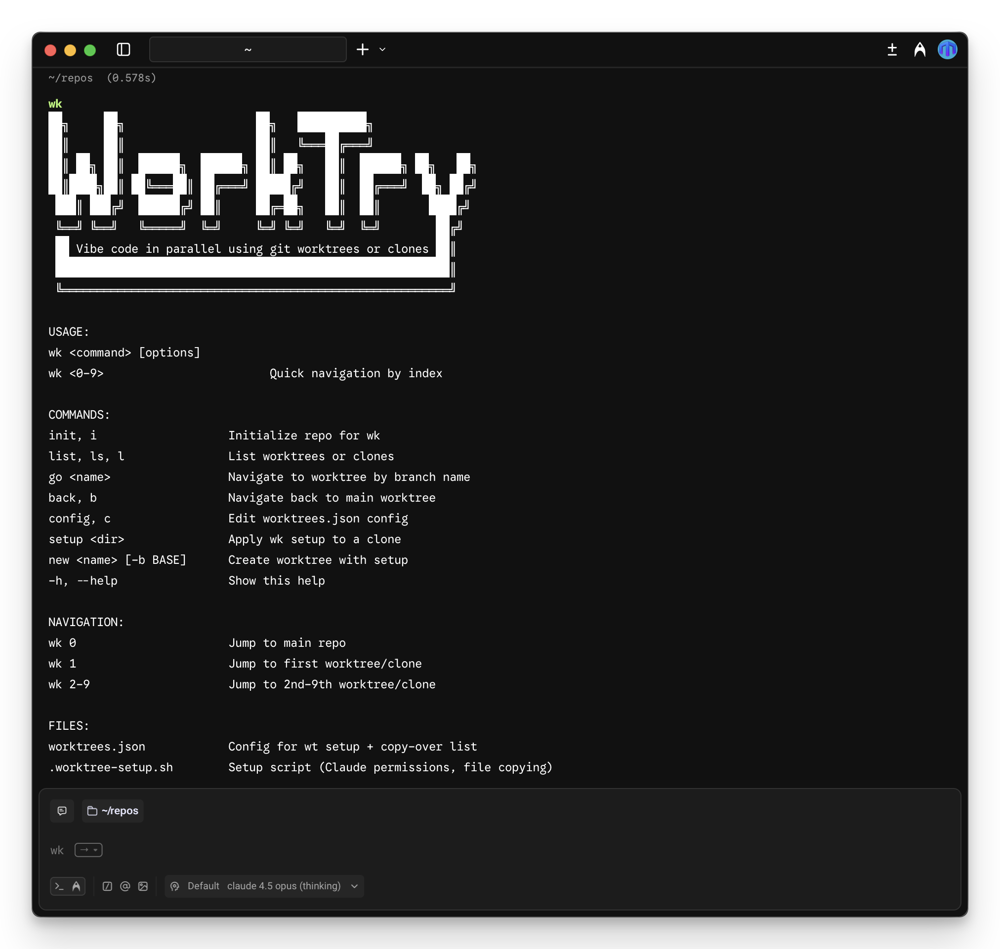

# Worktry (wk CLI)

Vibe code in parallel using git worktrees or clones.

```
██╗     ██╗                   ██╗   ██████████╗
██║     ██║                   ██║   ╚═══██╔═══╝
██║ ██╗ ██║  ██████╗  ██████╗ ██║ ██╗   ██║  ██████╗ ██╗   ██╗
██║████╗██║ ██╚═══██║ ██╔═══╝ █████╔╝   ██║  ██╔═══╝  ██╗ ██╔╝
 ███║ ███╔╝  ██████╔╝ ██║     ██╔═██╗   ██║  ██║       ████╔╝
 ╚══╝ ╚══╝   ╚═════╝  ╚═╝     ╚═╝ ╚═╝   ╚═╝  ╚═╝        ██╔╝
 ██ Vibe code in parallel using git worktrees or clones ██║
 █████████████████████████████████████████████████████████║
 ╚════════════════════════════════════════════════════════╝
```



## 🤔 Why?

Work on multiple features in parallel — each in its own isolated worktree or clone, with Claude Code ready to go.

**wk** (or `worktry`) sets up your repo for parallel AI development:
- 🤖 Auto-configures Claude Code permissions in each worktree/clone
- 📁 Copies config files (`.env`, `.idea/`) to new worktrees/clones
- 🚀 Jump between worktrees or clones instantly (`wk 1`, `wk 2`, etc.)

## ⚡ Quick Start

```bash
# Install dependencies
npm install -g @johnlindquist/worktree

# Install wk
git clone https://github.com/ovitrif/worktry.git
cd worktry && ./install.sh

# In your project
cd your-project
wk init                   # Setup worktrees.json
wk config                 # Add files to copy-over list
wt setup feature -c       # Create worktree with setup
wk 1                      # Jump to worktree
wk 0                      # Jump back to main
```

## 📦 Installation

### Prerequisites

- **Node.js** (v18+) — [nodejs.org](https://nodejs.org)
- **worktree-cli** — `npm install -g @johnlindquist/worktree`
- `~/.local/bin` in your PATH

### Install

```bash
git clone https://github.com/ovitrif/worktry.git
cd worktry
./install.sh
```

This installs:
- `wk` script to `~/.local/bin/` (with `worktry` alias)
- Shell function to `~/.zshrc` (or `~/.bashrc`) for navigation

## 📖 Usage

### 1. Initialize A Repo

```bash
cd your-project
wk init    # or: wk i
```

Creates:
- `worktrees.json` — Config for `wt setup` + `copy-over` list
- `.worktree-setup.sh` — Setup script (Claude permissions + file copying)

### 2. Configure Files To Copy

```bash
wk config    # or: wk c
```

Edit the `copy-over` array in `worktrees.json`:

```json
{
  "setup-worktree": ["bash $ROOT_WORKTREE_PATH/.worktree-setup.sh"],
  "copy-over": [
    ".env",
    "local.properties",
    ".idea/"
  ]
}
```

### 3. Create Worktrees

```bash
wt setup feature-name -c
```

Creates a worktree with:
- New branch `feature-name`
- `.claude/settings.local.json` with permissions
- Copies of files from `copy-over` list

### 4. Setup Existing Clones

If you prefer cloning over worktrees:

```bash
gh repo clone user/repo repo-2    # Clone manually
wk setup ../repo-2                # Apply wk setup to clone
```

### 5. Navigate

```bash
wk 0                      # Jump to main repo
wk 1                      # Jump to first worktree/clone
wk 2                      # Jump to second worktree/clone
wk go feature-name        # Jump by branch name (worktree mode)
wk back                   # Jump back to main (alias: b)
```

## 🛠️ Commands

| Command | Alias | Description |
|---------|-------|--------------|
| `wk init` | `i` | Initialize repo for wk |
| `wk list` | `ls`, `l` | List worktrees or clones |
| `wk go <name>` | — | Navigate to worktree by branch name |
| `wk back` | `b` | Navigate back to main worktree |
| `wk config` | `c` | Edit worktrees.json config |
| `wk setup <dir>` | `s` | Apply wk setup to a clone |
| `wk new <name> [-b BASE]` | `n` | Create worktree with setup |
| `wk 0-9` | — | Navigate to worktree/clone by index |
| `wk --help` | `-h` | Show help |

> **Note:** `worktry` is also available as an alias for `wk`.

## 📁 Files

| File | Description |
|------|-------------|
| `worktrees.json` | Config for `wt setup` + `copy-over` list |
| `.worktree-setup.sh` | Setup script (Claude permissions, file copying) |

## 🤝 Contributing

Contributions welcome! Feel free to:

1. Fork the repo
2. Create a feature branch
3. Submit a PR

### AI Agents

This project supports vibe-coding with AI agents. See [AGENTS.md](AGENTS.md) for project context and coding rules.

## 📄 License

[The Unlicense](https://unlicense.org) — Public domain. Do whatever you want.

See [LICENSE](LICENSE).
